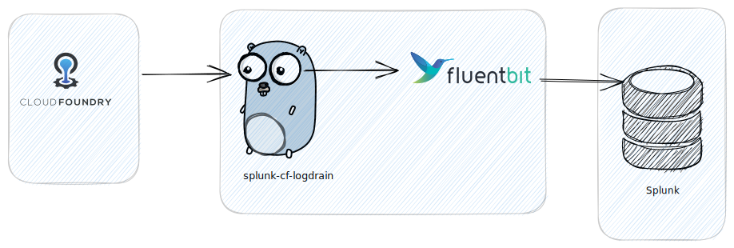

# splunk-cf-logdrain



User deployable service which implements a pipeline consisting of a small Go app and a fluent-bit sidecar process. It presents a CF compatible logdrainer endpoint which accepts RFC5424 messages, forwards them to the fluent-bit side-car process, which in turn forwards the log messages to splunk, done.

## Usage

* Deploy the logdrainer and create a user defined splunk service in your Cloud foundry Org
* Bind apps to the splunk service to activate forwarding 

## Splunk set up

* Configure a HTTP Event Collector (HEC) Data input (Settings -> Data inputs)
* Make sure to uncheck `Enable indexer acknowledgement`
* Copy the token for use in config below `SPLUNK_TOKEN`

## Logdrain set up

* Configure environment variables

| Environment     | Description                        | Recommended value                     |
|-----------------|------------------------------------|---------------------------------------|
 | FLUENT_BIT_PORT | The fluent-bit listen port metrics | 8080                                  |
 | LISTEN_PORT     | The logdrain HTTP listen port      | 2020                                  | 
 | SPLUNK_HOST     | The splunk host to forward to      | Example: `prd-p-xxxx.splunkcloud.com` |
 | SPLUNK_TOKEN    | The Splunk HEC token               |                                       |
 | TOKEN           | The logdrain TOKEN value           |                                       |

## Example deployment manifest

```yaml
---
applications:
- name: splunk-cf-logdrain
  env:
    TOKEN: <<RANDOM TOKEN HERE>>
    SPLUNK_TOKEN: <<SPLUNK HEC TOKEN HERE>>
    SPLUNK_HOST: splunk-ingest-host-here.com
    FLUENT_BIT_PORT: '8080'
    LISTEN_PORT: '2020'
  docker:
    image: ghcr.io/philips-software/splunk-cf-logdrain:v0.1.0
  routes:
  - route: splunk-cf-logdrain.cloud.pcftest.com
    protocol: http1
  processes:
  - type: web
    instances: 1
    memory: 1024M
    disk_quota: 1024M
    log-rate-limit-per-second: -1
    health-check-type: port
```

## Post deployment setup

Once the app is deployed it will expose a Cloud foundry compatible logdrain endpoint:

```
https://cf-splunk-logdrain-app.domain/syslog/drain/{{TOKEN}}
```

You can then create a user defined logging service:

```shell
cf cups splunk-logdrain -l https://cf-splunk-logdrain-app.domain/syslog/drain/{{TOKEN}}
```

Bind it to an app and restart to activate logging:

```shell
cf bind-service my-app splunk-logdrain
cf restart my-app
```

You should now see Cloud foundry logs appearing in your Splunk cluster

## License

License is MIT
